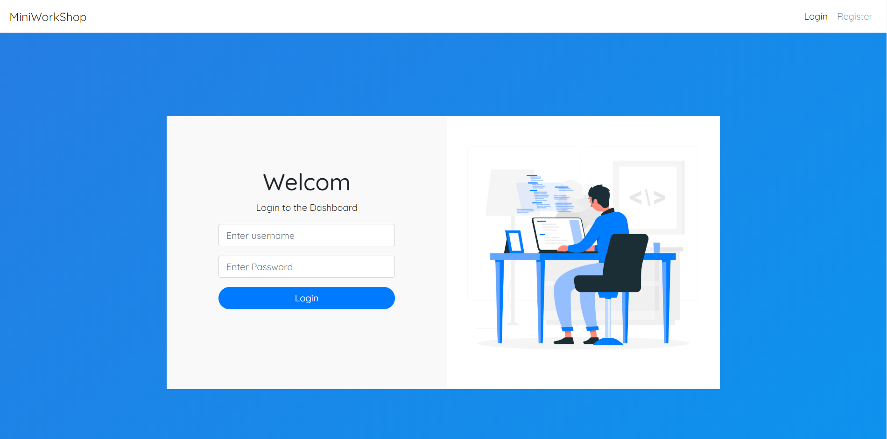
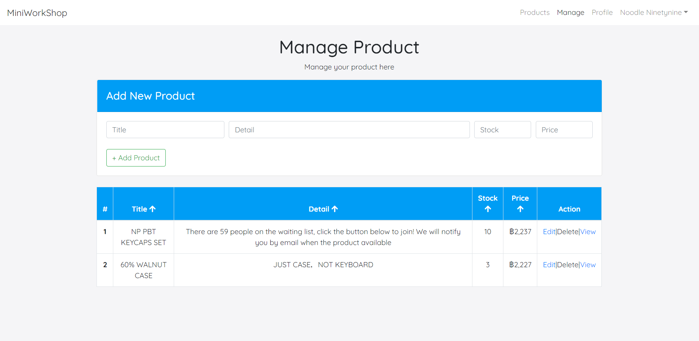
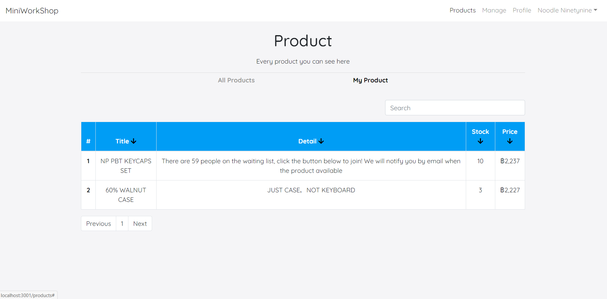

# workshop-reactjs

This Webside mad for practice react skill.  
Example preview the webside  
## Login page UI

## Manage-Product page UI

## Product page UI

# How to Run Project
In the project directory, you can run:

### `npm install`
Install the dependencies in the local node_modules folder.

### `npm start`
Runs the app in the development mode. 
Open [http://localhost:3000](http://localhost:3000) to view it in the browser.

The page will reload if you make edits. 
You will also see any lint errors in the console.

